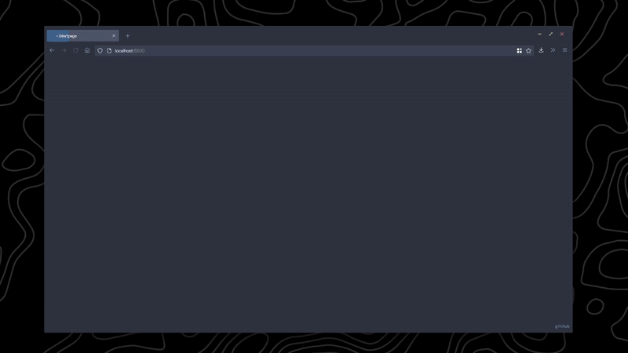

# Startpage <!-- omit in toc --> 

[Live preview (no weather as to not leak API key)](https://startpage.easun.me)

<!-- [Live Preview](https://kencx.github.io/startpage/) -->
## Table of Contents <!-- omit in toc --> 
- [Installation](#installation)
	- [Materials](#materials)
	- [Instructions](#instructions)
		- [Basic Setup](#basic-setup)
		- [Getting an OpenWeatherMap API Key](#getting-an-openweathermap-api-key)
		- [Changing the search engine](#changing-the-search-engine)
		- [Using as a new tab/disabling animations](#using-as-a-new-tabdisabling-animations)
- [Browser setup](#browser-setup)
- [Misc. Info](#misc-info)
## Installation

### Materials
- Code editor (e.g. VSCode, Notepad++, etc.)
- Basic html/css/js knowledge (optional, but recommended)
- OpenWeatherMap API Key (only if you want to use the weather feature)

### Instructions

#### Basic Setup

#### 🏡 As Home Page

1. Fork this repo
2. Enable the Github Pages service `Settings → GitHub Pages → Source [master branch] → Save`
3. Set it as Home Page:
   - Click the menu button. and select Options. Preferences.
   - Click the Home panel.
   - Click the menu next to Homepage and new windows and choose to show custom URLs and add your `Github Pages link`

#### ➕ As New Tab

You can use different Add-ons/Extensions for it

- If you use Firefox: [Custom New Tab Page](https://addons.mozilla.org/en-US/firefox/addon/custom-new-tab-page/?src=search) and make sure you enable "Force links to open in the top frame (experimental)" in the extension's preferences page.
- If you use Chromium (Brave, Vivaldi, Chrome): [Custom New Tab URL](https://chrome.google.com/webstore/detail/custom-new-tab-url/mmjbdbjnoablegbkcklggeknkfcjkjia)

#### Getting an OpenWeatherMap API Key
1. Go to [OpenWeatherMap](https://home.openweathermap.org/users/sign_up) and sign up.
2. Check your inbox for an email from OpenWeatherMap to verify your email address, and verify it.
3. Go to [the OpenWeatherMap API page](https://home.openweathermap.org/api_keys). There should be an API key already generated for you. If not, generate one. The API key name does not matter.
4. You should now have an API key! It will take a few hours for it to be active, please do not panic if the weather does not show up unless it has been many hours.

#### Changing the search engine
By default, the search engine is DuckDuckGo. You can change it to another search engine of choice by replacing the link in the `<form>` tag with another below.

|Search Engine |Link  |
--- | --- |
|Google|`https://google.com/search`|
|Duckduckgo|`https://duckduckgo.com/`|
|Bing|`https://bing.com/search`|
|Ask Jeeves (why)|`https://askjeeves.net/results.html`|

#### Using as a new tab/disabling animations
This is meant as a start page, and not a new tab page because of the animations. 

This [(firefox)](https://addons.mozilla.org/en-US/firefox/addon/new-tab-override/) or [(chrome/chromium-based)](https://chrome.google.com/webstore/detail/new-tab-redirect/icpgjfneehieebagbmdbhnlpiopdcmna) extension changes the new tab page, and you can follow the directions below use it.

Use as a new tab (only step 3 to disable animations):
1. Make a copy of the `index.html` file after you finished with the [basic setup](#basic-setup).
2. Rename it to `newTab.html` (you can name it other things too, I just recommend this).
3. Open `newTab.html` file in your code editor of choice.
   1. In the `<script>` tag, change the `animated` variable to `false`.
4. In the extension settings, set the new tab page to `file:///[PATH TO STARTPAGE]/newTab.html` (example: `file:///D:/documents/startpage/newTab.html`)

## Browser setup
- Browser: Firefox
- Theme: [Nord - Firefox Theme](https://www.deviantart.com/dpcdpc11/art/Nord-for-Firefox-837860916)
- Font: Product Sans

## Misc. Info
- Startpage Font: Source Code Pro
- Cat Gif: [Here](https://twitter.com/avogado6/status/1165595520967954432?s=19)

